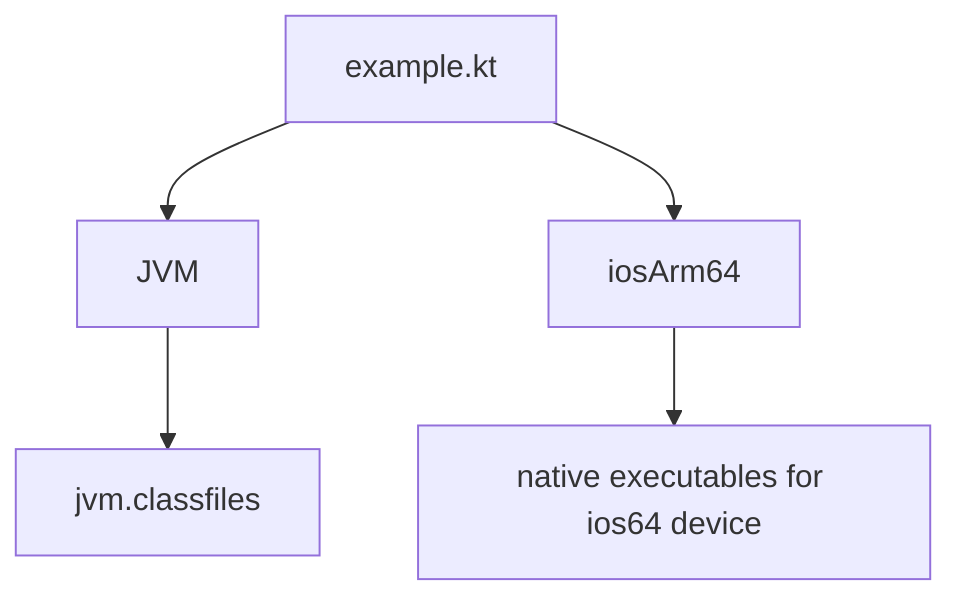
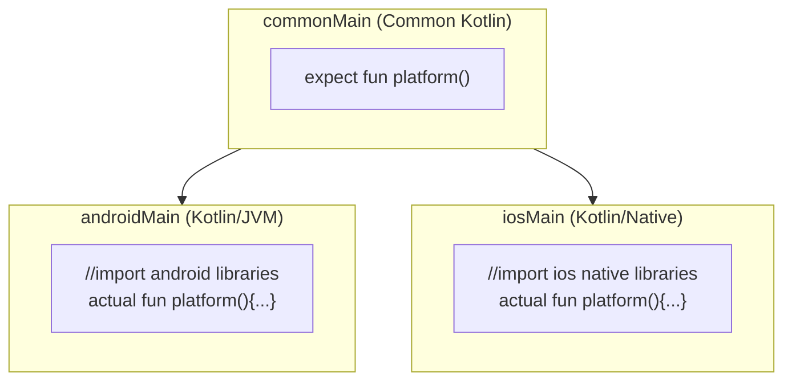
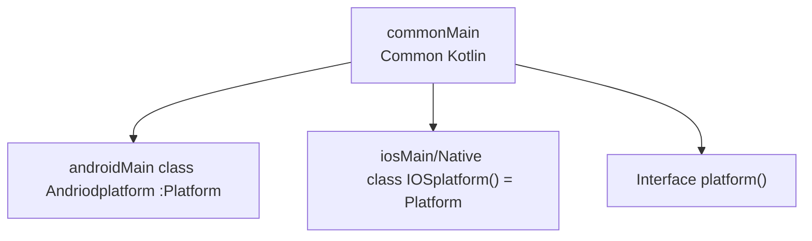
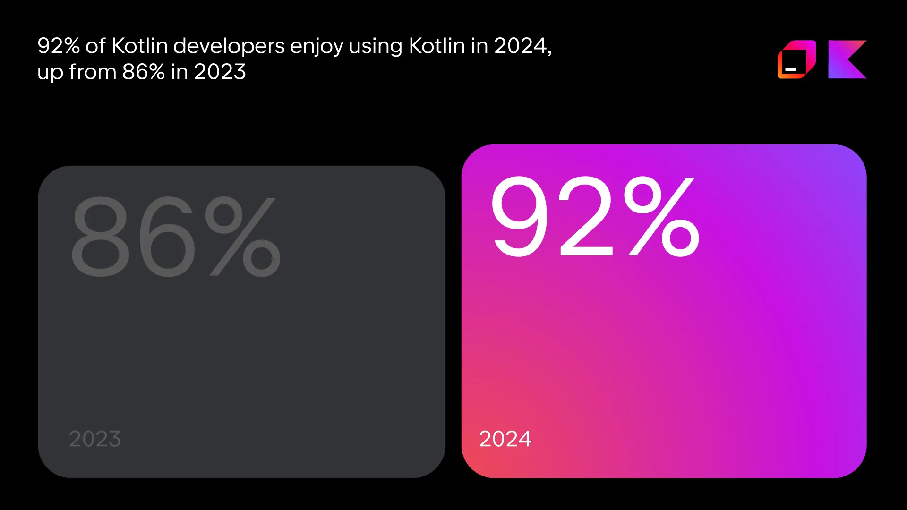

# Kotlin Multi Platform

→ Used to share code for multiple platforms like in both Android and IOS.

## Project Structure:

→ Structure:

```kotlin
shared/
 ├── src/
 │   ├── commonMain/
 │   │    └── kotlin/
 │   │         └── com/example/shared/Logic.kt
 │   ├── androidMain/
 │   │    └── kotlin/
 │   │         └── com/example/shared/AndroidStuff.kt
 │   ├── iosMain/
 │        └── kotlin/
 │             └── com/example/shared/IosStuff.kt
```

→Gradle declaration:

```kotlin
kotlin{

		jvm() //This declares a JVM target

		iosArm64() //Declares a target that corresponds to 64-bit iphones
}
```

→With  jvm and iosArm64 targets, the common code in commonMain will be compiled to these targets.

→ Common Code declaration:



## Source Sets:

→it contains its own targets, dependencies, and compiler options.

→ In shared folder it has commonMain, iosMain, jvmMain source sets.

```kotlin
kotlin {
    // 🔹 Declare your targets
    androidTarget()
    iosX64()
    iosArm64()
    iosSimulatorArm64()

    // 🔹 Declare and configure your source sets
    sourceSets {
        val commonMain by getting {
            dependencies {
                implementation("org.jetbrains.kotlinx:kotlinx-coroutines-core:1.9.0")
                implementation("io.ktor:ktor-client-core:3.0.0")
            }
        }

        val commonTest by getting {
            dependencies {
                implementation(kotlin("test"))
            }
        }

        val androidMain by getting {
            dependencies {
                implementation("io.ktor:ktor-client-okhttp:3.0.0")
            }
        }

        val androidUnitTest by getting

        val iosMain by creating {
            dependsOn(commonMain)
            dependencies {
                implementation("io.ktor:ktor-client-darwin:3.0.0")
            }
        }

        val iosTest by creating {
            dependsOn(commonTest)
        }

        // Connect iOS architectures to iosMain
        val iosX64Main by getting { dependsOn(iosMain) }
        val iosArm64Main by getting { dependsOn(iosMain) }
        val iosSimulatorArm64Main by getting { dependsOn(iosMain) }
    }
}
```

→ commonMain(Shared code):

→asks which platform we need to run the code.

```kotlin
package com.example.shared

class Greeting {
    fun greet(): String {
		    //which platform i need
        return "Hello from ${Platform().platformName} 👋"
    }
}

// Declare the expect class (platform-specific implementation will come later)
expect class Platform() {
    val platformName: String
}
```

→ AndroidMain (for android):

```kotlin
package com.example.shared

class Platform {
    val platformName: String = "Android ${android.os.Build.VERSION.SDK_INT}"
}
```

→ iosMain(for ios):

```kotlin
package com.example.shared

import platform.UIKit.UIDevice

class Platform {
    val platformName: String =
        "${UIDevice.currentDevice.systemName()} ${UIDevice.currentDevice.systemVersion}"
}

```

## expected and actual functions and properties.

→In common source set of a multiplatform module there will be an expected declaration.

→Then, every platform source set has actual declaration “in short for every expect there must be a actual declaration”



## Interfaces in common code:



```kotlin
// In the commonMain source set:
interface Platform {
    val name: String
}

// In the androidMain source set:
import android.os.Build

class AndroidPlatform : Platform {
    override val name: String = "Android ${Build.VERSION.SDK_INT}"
}

// In the iosMain source set:
import platform.UIKit.UIDevice

class IOSPlatform : Platform {
    override val name: String = UIDevice.currentDevice.systemName() + " " + UIDevice.currentDevice.systemVersion
}
```

### → Dependencies on Kotlin library :

1.Test Libraries : To bring all the platform dependencies automatically.

2.Kotlinx Libraries : for using multiplatform library and need to depend on the shared code set this dependency only once in the shared source set.

→ Example:

```kotlin
kotlin {
    //...
    sourceSets {
        commonTest.dependencies {
            implementation(kotlin("test")) // Brings all the platform dependencies automatically
            implementation("org.jetbrains.kotlinx:kotlinx-coroutines-core:1.10.2")
        }
    }
}
```

→Note : For running and testing ios app MacOs must be used you cannot run it in windows but you can share your code in both androidMain and iosMain.

## Why we need to use Kotlin multi platform in our projects:

1. KMP helps us to avoid code duplication also results in consistent and good experience in both Android and iOS apps.
2. KMP supports for many platforms like Android, iOS, desktop, web(JavaScript and WebAssembly), and JVM which reduces app size and other uses.
3. KMP provides simplified code-sharing mechanisms for better readability and maintainability also helps developers to catch errors early during compilation or while writing code for better reliable and minimizing the risk of runtime errors.
    
    The Below image should how Kotlin is getting more positive user experiences.
    
    
    
4. KMP allows for flexible multiplatform development means developers no longer needed to decide to choose between native and cross-platform development.
    
    →Before KMP developers should write everything natively:
    
    
    
    →After KMP allows developrs to share all the requirements, [https://www.jetbrains.com/compose-multiplatform/](https://www.jetbrains.com/compose-multiplatform/)
    
    
    
5. With KMP solution, we can share UI code across all the platforms based on Kotlin and Jetpack Compose.
6. We can use KMP in existing and new projects both, for existing project just unify more libraries and more logic and then codebase shared across platforms. for new projects just create a project with selecting Kotlin Multiplatform.
7. With KMP, we can start sharing our code gradually which helps in the technology. Ex: Data models, networking, etc.
8. KMP is already used by global companies like Forbes, Philips, Autodesk and many other.
9. KMP Provides powerful tooling support like Android Studio which provides a comprehensive suite for coding, debugging and also with feature of Emulator. And Xcode which is Apple’s IDE is  part of KMP apps for iOS app development.

### For more information visit :

1. Kotlin Multiplatform by JetBrains
    
    [https://developer.android.com/courses/pathways/kotlin-multiplatform](https://developer.android.com/courses/pathways/kotlin-multiplatform)
    
2. google Developers
    
    [https://www.jetbrains.com/help/kotlin-multiplatform-dev/get-started.html](https://www.jetbrains.com/help/kotlin-multiplatform-dev/get-started.html)
